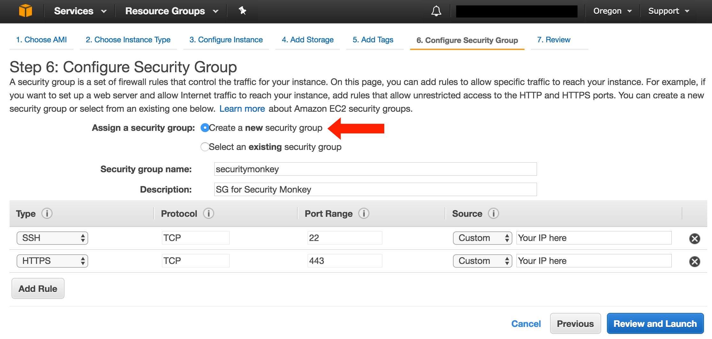

Launch Security Monkey in AWS
======================

Netflix monitors dozens AWS accounts easily on a single m3.large instance. For this guide, we will launch a m1.small.

**Please Note: It is highly recommended that you operate Security Monkey on an instance with at least of 1.7GB of RAM. 
You may encounter installation issues if you have less than 1.7GB of RAM. See [#580](https://github.com/Netflix/security_monkey/issues/580) for details.**

Launch a new Instance:
----------------------

In the console, start the process to launch a new Ubuntu LTS instance:

Select an m1.small and select "Next: Configure Instance Details".

**Note: Do not select "Review and Launch". We need to launch this instance in a specific role and select security groups.**

Under "IAM Role", select `SecurityMonkeyInstanceProfile`:

Continue to `Step 6. Configure Security Group`. In here, select `Create a new security group`. Name the security group `securitymonkey`, and
ingress in port `22` so you can SSH onto the instance when created, as well as port `443` so that you can access the web UI:

You may now launch the new instance. Please take note of the "Public DNS" entry. We will need that later when configuring security monkey.

Now may also be a good time to edit the "launch-wizard-1" security group to restrict access to your IP. Make sure you leave TCP 22 open for ssh and TCP 443 for HTTPS.

Keypair
-------

You may be prompted to download a keypair. You should protect this keypair; it is used to provide ssh access to the new instance. Put it in a safe place. You will need to change the permissions on the keypair to 400:

    $ chmod 400 SecurityMonkeyKeypair.pem

Connecting to your new instance:
--------------------------------

We will connect to the new instance over ssh:

    $ ssh -i SecurityMonkeyKeyPair.pem -l ubuntu <PUBLIC_IP_ADDRESS>

Replace the last parameter (\<PUBLIC\_IP\_ADDRESS\>) with the Public IP of your instance.

Next:
-----

- [Back to the Quickstart](quickstart.md#install-security-monkey-on-your-instance)